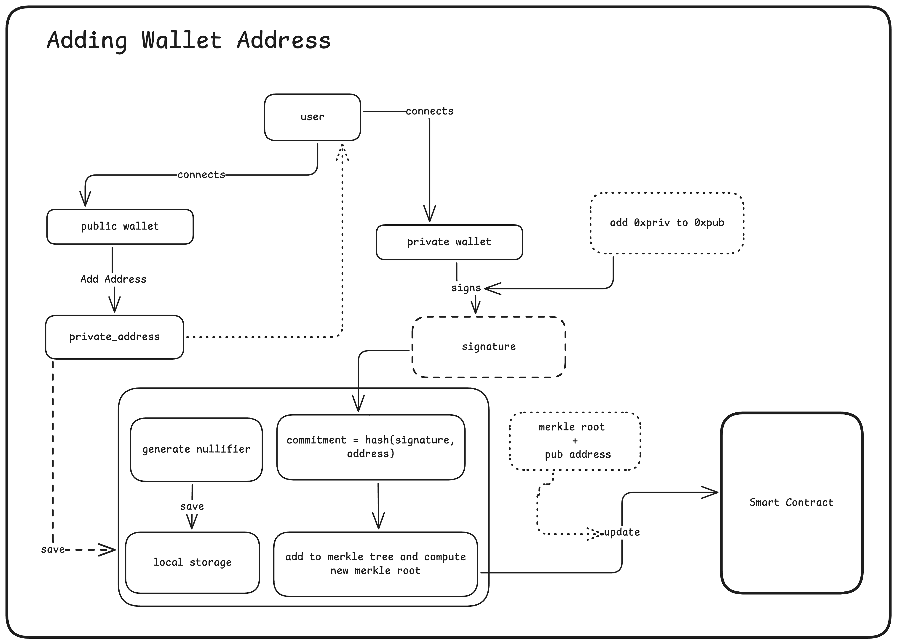
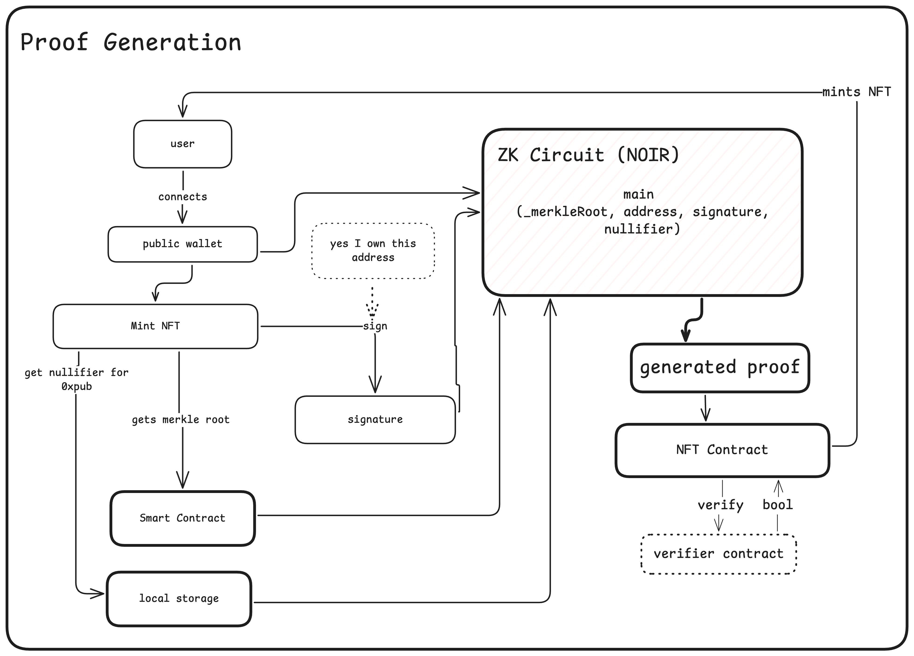

# TruScore

## To Do

### Circuit

- [ ] Implement the Merkle tree inclusion proof.
- [ ] Implement ECDSA signature verification using `(r, s)` and `(public_key_x, public_key_y)` inputs.
- [ ] Compute `commitment = PoseidonHash(address || nullifier)` inside the circuit.
- [ ] Compare recomputed Merkle root with the provided root (assert inclusion).

### Smart Contract

- [ ] Verifier contract to verify ZK proof.
- [ ] NFT contract for minting the reputation badge.
- [ ] Merkle tree contract to store and update the Merkle root for each profile.

### Backend (Optional / Light)

- [ ] API to fetch the score from [OnChainScore API](https://onchainscore.xyz/api).
- [ ] (Optional) Helper endpoint to assist client with score aggregation if needed.

### Frontend

- [ ] Add a button to connect the mint wallet (public wallet).
- [ ] Add private wallet addresses into the Merkle tree (with nullifier generation).
- [ ] Recover public key `(x, y)` off-chain from signature using Viem / ethers / noble-secp256k1.
- [ ] Store the `nullifier` and linked wallet addresses securely in local storage.
- [ ] Generate the ZK proof using `noirjs`, passing:
  - `signature (r, s)`
  - `public_key (x, y)`
  - `nullifier`
  - `address`
  - `sibling_path`
  - `path_indices`
- [ ] Verify the proof on-chain via the verifier contract.
- [ ] Mint the NFT after successful proof verification.

## Design Decisions

- ✅ Public key recovery will be done off-chain.
- ✅ Signature verification and Merkle inclusion will both be proven inside the ZK circuit.
- ✅ No wallet switching required during proof generation if public mint wallet is included in the Merkle tree.

## Overview

TruScore is the privacy first reputation score generated using on-chain data of the user while keeping the user's identity private.

It's an implementation of the https://onchainscore.xyz/ but with the following differences:

- It doesn't disclose the EVM addresses of the user.
- It doesn't disclose the social handles of the user like twitter,lens, github etc.
- Creates a dynamic NFT which will be minted to the user's choice of wallet.

## What problem does it solve?

Everyone has several addresses or social handles which they want to keep private. But keeping them private makes it hard to get a good reputation score.

## How does it work?

The flow of generating a reputation score is as follows:

1. User connect their wallet.
2. User ask to generate a score for a given address (0xabc) by signing a message with the same address(0xabc) ensuring the ownership of the address.
3. TruScore fetches the reputation using the [onchain score api](https://onchainscore.xyz/api) for the requested address.
4. TruScore generates a dynamic NFT with the score and mints it to the user's choice of wallet.

## Proving the address ownership

1. User connects their public address (megabyte.base.eth) and generate a profile if (101)
2. User add their private address (0xabc)
3. Now, the user needs to switch their wallet for signing to prove ownership of the wallet address.
4. After signature generation, a commitment and nullifier will be generated on the client and nullifier will be stored in the local storage.
5. The commitment hash will be stored in a Merkle tree, and the root of merkle tree will be stored on Smart Contract.
6. When a user request to update their onchain score, they will be requested to prove that they own **any one** of the linked wallet address(s).
7. The zk proof will be generated using circuit build with Noir. The circuit will verify the merkle root and generate proof.
8. The NFT will be minted after verification of the proof to the public wallet.

## Workflow

### Adding Address

### Generating Proof

## How to run

### Prerequisites

- `make`
- `nargo`
- `bb`

### Steps

1. Clone the repository
2. Run `make compile-cir` to compile the circuits
3. Run `make execute-cir` to execute the circuits with the given inputs in `./circuit/Prover.toml`
4. Run `make gen-proof` to generate the proof
5. Run `make gen-vk-sol` to generate the verification key for solidity
6. Run `make gen-verifier-contract` to generate the verifier contract
